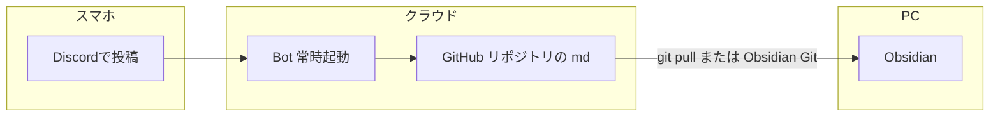

# Discord → GitHub 自動追記（本気の自動化）

**ゴール**：Discord の自分用チャンネルに **呟くだけ** で、**GitHub 上の Markdown**（既定では `[[Discord自動受信箱]]`）に **1行ずつ自動で追記**される。

**いまの iCloud Obsidian だけ**では、Discord からファイルを直接いじれないので、**「受け取り先を GitHub に置く」** のが定石です。

---

## ざっくり全体像



- **Bot**：あなたのメッセージを見て、GitHub API でファイルを更新する小さなプログラム（Vault 内 `brain/scripts/discord_inbox_bot/`）。
- **あなたの作業**：PC で **リモジトリを最新にする**（`git pull` や Obsidian Git プラグイン）。そうすると `Discord自動受信箱.md` に新しい行が見える。

---

## 事前に決めること（重要）

### 1. iCloud と Git をどう両立するか

| パターン | 内容 |
|----------|------|
| **A. Git を正にする（おすすめ）** | Vault 全体を **プライベート GitHub** に置き、スマホは **Obsidian Git** や **Working Copy** などで pull/push。iCloud の同じフォルダはやめるか、Git 以外は使わない。 |
| **B. 受信箱だけ別リポジトリ** | 本番 Vault は iCloud のまま。**Discord用の1ファイルだけ** を別リポジトリで Bot が更新。PC でそのファイルを手動コピー or たまにマージ。運用はやや面倒。 |

**同じファイルを iCloud と Git で二重に編集**すると競合しやすいので、**どちらが「正」かを1つに**決めてください。

### 2. Bot をどこで動かすか

| 場所 | メモ |
|------|------|
| **家の Mac を起動しっぱなし** | いちばん簡単。ターミナルで `python bot.py` を動かしっぱなし（寝る前に別室の Mac がオンならベッドからも使える）。 |
| **Railway / Fly.io 等** | Mac を付けっぱなしにしたくないとき。無料枠の有無は各サービスの最新情報を確認。 |
| **自宅 Raspberry Pi** | 常時起動しやすい人向け。 |

---

## 手順チェックリスト

### フェーズ1：GitHub

- [ ] **プライベート** リポジトリを作成（または既存 Vault を push）
- [ ] 追記先ファイルをリポジトリに含める  
  - 既定パス：`brain/タスク管理/Discord自動受信箱.md`（既に Vault にあります）
- [ ] **Personal Access Token** を発行  
  - Fine-grained なら：そのリポジトリに **Contents: Read and write**  
  - Classic なら：`repo`  
- [ ] トークンは **メモ帳に一時保存**（あとで `.env` にだけ入れ、**Git に載せない**）

### フェーズ2：Discord

- [ ] [Discord Developer Portal](https://discord.com/developers/applications) で **New Application** → **Bot** を追加  
- [ ] **Reset Token** で Bot トークンをコピー（他人に見せない）  
- [ ] **Privileged Gateway Intents** で **MESSAGE CONTENT INTENT** を **オン**（必須）  
- [ ] **OAuth2 → URL Generator**：`scopes` は `bot`、`Bot Permissions` は最低限  
  - View Channels  
  - Read Message History  
  - Send Messages（リアクション用にチャンネル権限があれば可）  
  - Add Reactions  
- [ ] 出てきた URL をブラウザで開き、**自分だけのサーバー** に Bot を招待  
- [ ] 呟き用 **テキストチャンネル** を開き、**チャンネルID** をコピー（ユーザー設定 → 詳細 → 開発者モード → チャンネル右クリック）

### フェーズ3：Bot を動かす

- [ ] PC でターミナルを開く  
- [ ] `cd` して Vault の `brain/scripts/discord_inbox_bot/` に移動  
- [ ] `pip install -r requirements.txt`  
- [ ] `.env.example` を **コピー** して `.env` にリネームし、中身を埋める  

```env
DISCORD_BOT_TOKEN=...
DISCORD_CHANNEL_ID=123456789012345678
GITHUB_TOKEN=github_pat_...
GITHUB_REPO=あなたのユーザー名/リポジトリ名
GITHUB_FILE_PATH=brain/タスク管理/Discord自動受信箱.md
```

- [ ] `python bot.py` を実行  
- [ ] Discord のそのチャンネルに **テスト投稿** → **✅** が付き、数秒後に GitHub の該当ファイルが更新されているか Web で確認  
- [ ] PC のローカルで `git pull`（または Obsidian Git）→ Obsidian で `[[Discord自動受信箱]]` を開き、行が増えているか確認  

### フェーズ4：常時起動

- [ ] Mac なら **夜もスリープしない** 設定にするか、**別ホスティング** に移す  
- [ ] ターミナルを閉じると止まるので、**常時起動したい**なら `tmux` / `screen`、または launchd / systemd、または PaaS へデプロイ

---

## トラブルシュート

| 現象 | 見るところ |
|------|------------|
| Bot がオンラインにならない | トークン誤り、Intent 未設定 |
| メッセージに ✅ が付かない | チャンネルID違い、Bot にチャンネル閲覧権限がない |
| ✅ は付くが GitHub が変わらない | `GITHUB_REPO` / `GITHUB_FILE_PATH` / トークン権限 |
| 日本語パスで 404 | スクリプトはパスをエンコード済み。リポジトリ内にファイルが最初から存在するか確認（空でもコミットしておく） |

---

## セキュリティ

- **Bot トークン・GitHub トークンは絶対に公開リポジトリに push しない**  
- Discord サーバーは **自分だけ** にするか、**そのチャンネルだけ** Bot が反応するよう **チャンネルIDで限定**（スクリプトはすでにその方式）  
- 画像・添付ファイルは **現バージョンでは本文テキストのみ** 追記（拡張は可能だが未実装）

---

## コードの場所

- `brain/scripts/discord_inbox_bot/bot.py` … 本体  
- `brain/scripts/discord_inbox_bot/README.md` … 英語短縮メモ  

---

## 関連ノート

- [[ベッドからキャプチャ_LINE・Discord_セットアップ]]
- [[Discord自動受信箱]]
- [[Inbox]]
- [[README_運用ルール]]
